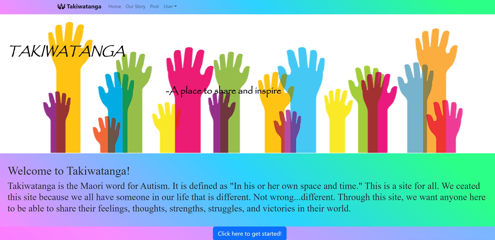
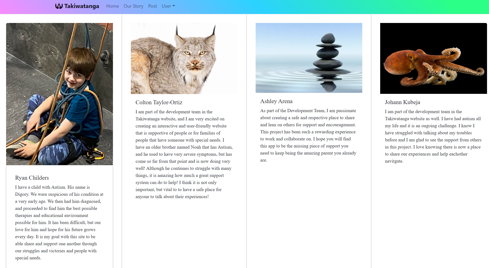
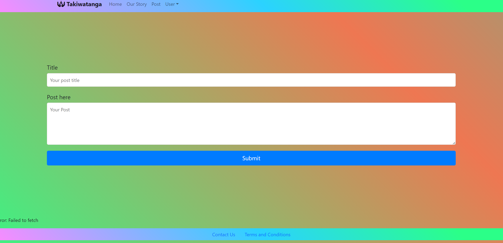
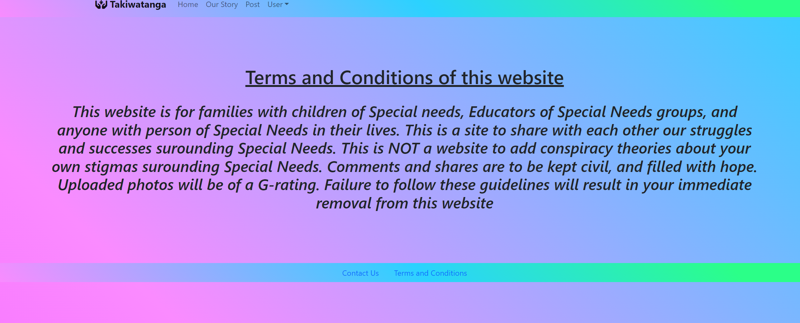

# Takiwatanga

## Screenshots

## Description
This is a group project for a coding bootcamp to demonstrate the collective knowledge gained from the class so far and the ability of each contributer to learn independently new skills to enhance the understanding and ability of said project. In this designed app users will be prompted to sign up or log in to begin which will therefore be stored into the database; which can be recalled upon. Once signed in, users will be directed to user dashboard displaying account and user information.

## Badges

## Visuals

## Installation

## Usage
The designed usage of this app would be for 

## Roadmap

## Contributing
At this time, we are not looking for contributions to the project. We are excited to work together and build something with the knowledge we have gained so far in our journey. As we understand there may be manys ways we can do things simplier or different, we want to show off certain technical knowledge and ability with our code.

## Authors and Acknowledgement
At this time we would to formally introduce the team and break down the acknowledgements of the work each person has presented and gifted this project. First it is always nice to work and develop skills with others, but working with each member has been truly rewarding.  

## Patrick "Ryan" Childers (https://github.com/Childy77) - Elected Team Leader.  
Created and styled each page. I created to initial HTML and CSS template to add to. I then took what the team developed in the working app and added more styling and format to make it more usable and functional.

Colton Taylor-Ortiz (https://github.com/)- 

Ashley Arena (https://github.com/aecarena) - 

Johann Kubeja (https://github.com/JohannKubeja) - 

## License
[Read MIT License](https://opensource.org/licenses/MIT)

## Project Status
Currently this project is a work in progress. Please note this was a course project to demonstrate skills and knowledge. 
